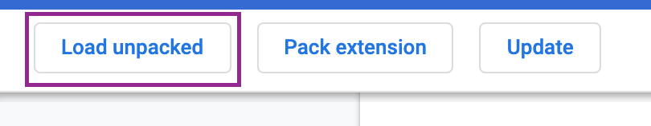

# TABULA: The Bookmark Manager with Notifications
Tabula is a bookmark manager chrome extension that helps you saving your favourite links by category and not forgetting about them thanks to its reminder notification system.

  &nbsp;   &nbsp;  
  &nbsp;   &nbsp;   

## Getting Started
1) Clone the repo.
2) To install dependencies run npm i.
3) In Chorme add the extensions in the extension page by clicking "Load unpacked".

## Built with
Javascript

HTML

CSS

## Author
Natalia Rizzi [link to Linkedin!](https://www.linkedin.com/in/nataliarizzi/?locale=en_US)

## Contributing

Improvements are welcome :)

Fork the repo and do your thing. Push to your fork and submit a pull request.

