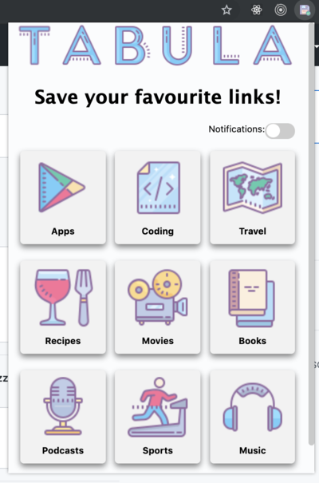
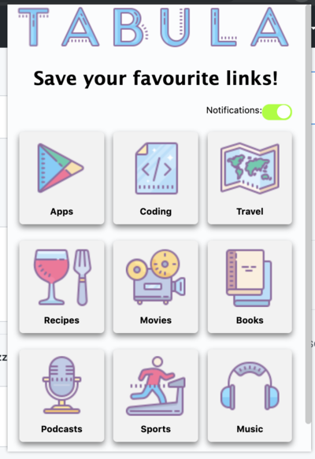
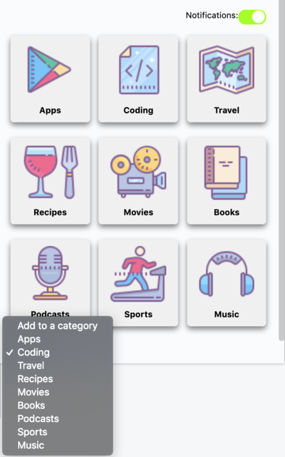
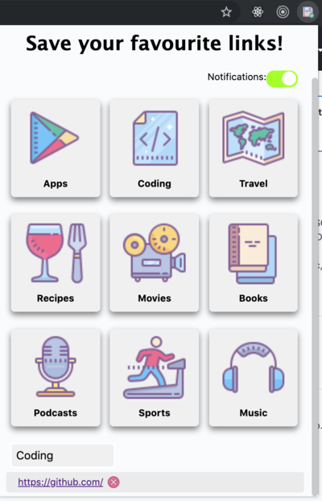

# TABULA: The Bookmark Manager with Notifications
// Description

<section>
  
  
  
  
</section>

## Getting Started
1) To install dependencies run npm i.
2) In Chorme add the extensions in the extension page by clicking "Load unpacked".

## Built with
Javascript

HTML

CSS

## Contributing

Improvements are welcome :)

Fork the repo and do your thing. Push to your fork and submit a pull request.

